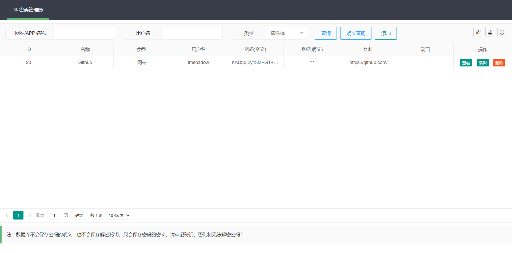

### 简易密码管理器

*学习 NodeJs，一个练手的小项目*

**技术**

- NodeJS
- LayUI
- MySQL

**功能**

- 添加密码
- 查询密码
- 修改密码
- 删除密码

**特点**

保存一条密码记录时，必须为其设置秘钥，用于加解密操作。数据库只会记录密码的密文，不会保存明文和秘钥。因此，就算数据库泄露，密码也依旧是安全的。缺点是秘钥需要人工记忆，如果忘记，则无法解密密码。

**运行**

1.安装 node 依赖

```
npm install
```

2.导入数据表

新建一个名为 `pm` 的数据库，导入 sql 文件夹中的数据表

3.修改 `index.js` 中数据库的配置

4.启动

```
npm start
```

**截图**

